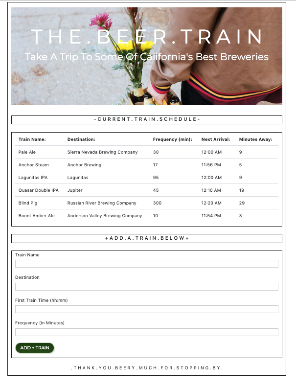

# T H E . B E E R . T R A I N

This is my submission for homework assignment number 7: Train Scheduler. We were tasked with creating a website in which a user inputs the name, destination, frequency, and next arrival of a "train" they are able to create via our form inputs. What the user writes in the input is then stored in our Firebase database and then appended to the webpage in the form of a table. The user can create multiple trains and they will all display in the table. Using moment.js, I was able to calculate the next arrival and minutes to arrival of each train. In order to accomplish this, we had to use our recent understanding of jQuery, Firebase Database, JavaScript, Bootstrap, HTML, & CSS.

Tech I Used:

[HTML](https://www.w3schools.com/html/)

[Bootstrap](https://getbootstrap.com/docs/4.3/getting-started/introduction/)

[Firebase](https://firebase.google.com/)

[CSS](https://www.w3schools.com/css/)

[JavaScript](https://www.w3schools.com/js/)

[jQuery](https://www.w3schools.com/jquery/)

Author: [Matthew Hagarty](https://github.com/matthewryanhagarty)